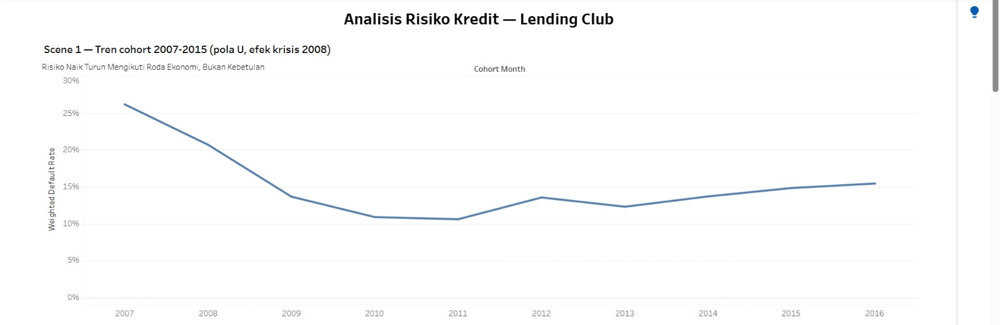
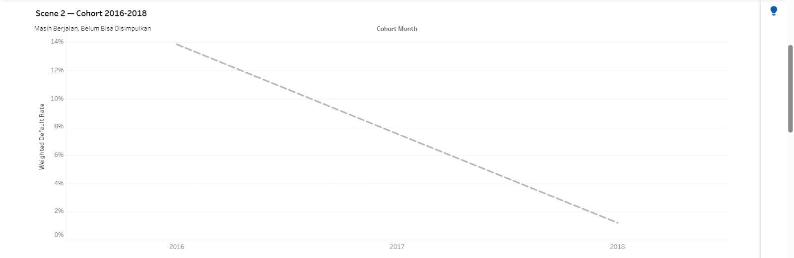
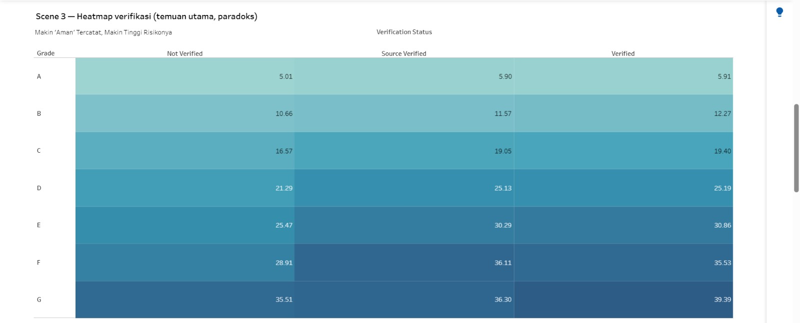
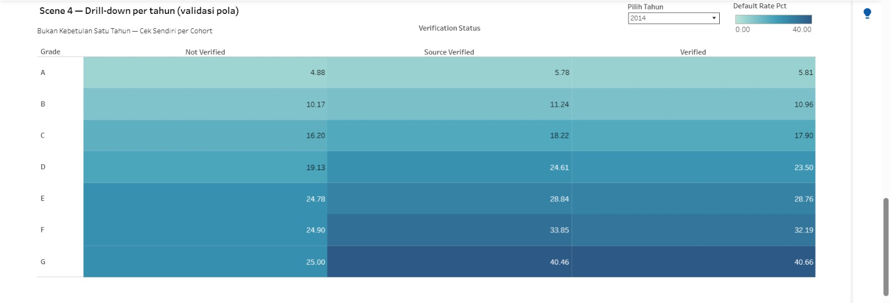

# Fatwa Ferdiansyah — Data Analyst Portfolio

**Pekanbaru, Riau, Indonesia**
[Email](mailto:fatwaferdiansyah97@gmail.com) · [LinkedIn](https://www.linkedin.com/in/fatwa-ferdiansyah-9951ba278) · [GitHub](https://github.com/fatwaferdiansyah97-dev)

---

## About Me

Lulusan Sarjana Hukum (S.H.) dari Universitas Pancasakti Tegal, saat ini
bekerja sebagai **Penelaah Teknis Kebijakan** di Perwakilan Ombudsman RI
Provinsi Riau sejak Desember 2020. Meski jabatan formal saya bukan di
bidang data, pekerjaan sehari-hari saya banyak melibatkan analisis data, seperti
mengolah ratusan laporan pengaduan masyarakat tiap bulan, membangun
dashboard KPI, dan menerjemahkan pola data jadi rekomendasi kebijakan.

Pencapaian yang paling saya banggakan diantaranya, strategi berbasis data yang saya
rancang berhasil menaikkan peringkat penyelesaian laporan institusi saya
dari **peringkat 15 ke peringkat 2 secara nasional** dalam 2 tahun,
berdasarkan baku mutu internal Ombudsman RI.

Saat ini saya sedang bertransisi ke jalur karier **Data Analyst**,
memperdalam SQL, Python, dan visualisasi data (Tableau) lewat bootcamp
terstruktur. Kombinasi latar belakang hukum, pengalaman investigatif di
lembaga pengawasan publik, dan skill data yang terus saya bangun ini
membuat saya paling tertarik pada peran yang berhubungan dengan
**risk, compliance, dan fraud analysis**, area yang mempertemukan cara
berpikir investigatif dengan pembuktian berbasis data.

Detail pengalaman lebih lengkap ada di [Linkedin](#) *(www.linkedin.com/in/fatwa-ferdiansyah-9951ba278)*.

---

## Skills

**Data & Analytics:** Data Cleaning & Validation, Exploratory Data Analysis (EDA), Root Cause Analysis, KPI Analysis, Cohort/Vintage Analysis

**Tools:** SQL (Advanced) · Python — Pandas (Intermediate) · Tableau · Excel (Advanced) · Looker Studio · PostgreSQL

**Domain:** Data Governance, Regulatory Compliance, Data-Driven Decision Making

**Soft Skills:** Stakeholder Communication & Data Storytelling, Cross-Functional Collaboration, Executive Reporting

---

## Project: Credit Risk & Control Effectiveness Analysis — Lending Club (2007–2018)

**[Lihat Dashboard Interaktif di Tableau Public →](https://public.tableau.com/shared/KF5Y2HRP4?:display_count=n&:origin=viz_share_link)**

### Problem Statement

Bisnis pemberi pinjaman bergantung penuh pada satu hal: kemampuan menilai
risiko gagal bayar (default) secara akurat. Project ini menjawab dua
pertanyaan mendasar, dengan pendekatan yang lebih dekat ke cara berpikir
audit/investigatif daripada sekadar eksplorasi data biasa:

1. **Apakah kualitas risiko pinjaman berubah seiring waktu**, apakah
   ada hubungannya dengan kondisi ekonomi makro saat pinjaman dicairkan?
2. **Apakah kontrol verifikasi pendapatan yang diterapkan benar-benar
   menurunkan risiko gagal bayar**, atau cuma formalitas yang tidak
   terbukti efektif?

Pertanyaan kedua secara khusus dirancang dari sudut pandang
**pengawasan/audit**: bukan cuma "berapa risikonya", tapi "apakah sistem
kontrol yang sudah ada benar-benar bekerja sesuai tujuannya".

### Data Understanding & Preparation

- **Sumber data:** dataset publik Lending Club (Kaggle), 2.260.668
  pinjaman, periode Juni 2007 – Desember 2018.
- **Karakteristik penting:** data ini snapshot tunggal per pinjaman
  (kondisi per Februari 2019), bukan data panel bulanan, sehingga
  analisis usia-pinjaman dibangun dari pendekatan cohort (bulan
  pencairan), bukan kurva survival penuh.
- **Masalah data yang ditemukan dan ditangani:**
  - *Right-censoring*: pinjaman yang baru dicairkan belum tentu sempat
    gagal bayar. Solusinya, definisi populasi "matured" ditetapkan hanya pinjaman
    yang tenornya sudah lewat sepenuhnya yang dihitung dalam analisis
    tren utama.
  - Ditemukan 3.913 baris (0,5%) berstatus tidak final meski sudah
    lewat jatuh tempo, maka dikeluarkan dari populasi analisis dan
    didokumentasikan terpisah, bukan dihitung diam-diam.
  - Aplikasi bersama (*Joint App*, 5,3% data) dikeluarkan dari analisis
    karena struktur data verifikasinya berbeda dari aplikasi individual.

### Analysis Process

1. **Python** — reduksi kolom dari file mentah 1,1GB ke subset relevan.
2. **PostgreSQL** — seluruh logika pembersihan, definisi populasi
   (matured/censored), dan agregasi dikerjakan di level SQL (bukan di
   tools visualisasi), untuk memastikan satu sumber kebenaran yang
   konsisten di semua chart.
3. **Cohort methodology** — pinjaman dikelompokkan berdasarkan bulan
   pencairan, dibandingkan tren gagal bayarnya dari waktu ke waktu.
4. **Kontrol confounding variable** — perbandingan efektivitas
   verifikasi di-stratifikasi berdasarkan grade risiko (A–G) untuk
   menghindari kesimpulan keliru akibat grade yang sudah lebih dulu
   berkorelasi dengan siapa yang diverifikasi. Divalidasi ulang dengan
   mengontrol tahun cohort untuk memastikan pola bukan sekadar artefak
   pergeseran komposisi data dari waktu ke waktu.
5. **Tableau** — dashboard interaktif dengan 4 visualisasi bertahap
   (baseline → transparansi data belum final → temuan utama → validasi
   mandiri oleh pengguna dashboard).

### Key Insights

**1. Risiko kredit mengikuti siklus ekonomi, bukan sekadar profil individual peminjam.**
Pinjaman yang dicairkan menjelang krisis finansial 2008 punya default
rate 20–26%, turun ke 10–11% di masa pemulihan 2010–2011, lalu naik
bertahap kembali ke 13–15% pada 2012–2015.

**2. Paradoks verifikasi: status "terverifikasi" justru berkorelasi dengan risiko lebih tinggi, konsisten di semua grade (A–G).**
Pinjaman berstatus *Verified*/*Source Verified* punya default rate lebih
tinggi dari *Not Verified*, ini menunjukan pola yang bertahan bahkan setelah
dikontrol per grade dan per tahun cohort. Interpretasi paling masuk
akal: verifikasi kemungkinan diterapkan secara reaktif/selektif ke
pengajuan yang sudah terindikasi berisiko sejak awal (bias seleksi),
bukan bukti bahwa proses verifikasinya gagal secara kausal.

### Recommendations

1. **Sesuaikan bobot risiko dengan siklus ekonomi saat pencairan** —
   model scoring sebaiknya mempertimbangkan kondisi makroekonomi, tidak
   hanya profil individual peminjam.
2. **Audit ulang proses verifikasi pendapatan** — pola yang konsisten
   di semua grade risiko menunjukkan verifikasi kemungkinan diterapkan
   secara reaktif, bukan acak. Ini catatan untuk ditinjau, bukan bukti
   kegagalan sistem.
3. **Jangan jadikan status verifikasi sebagai sinyal "aman" tunggal** —
   kombinasikan dengan grade dan indikator lain sebelum dipakai sebagai
   dasar keputusan approval atau pricing.
4. **Perlu validasi lanjutan** dengan data proses underwriting (kapan
   dan kenapa suatu pinjaman diverifikasi) untuk memastikan pola ini
   murni efek seleksi, bukan faktor lain yang belum tertangkap di data.

### Visualizations

**Scene 1 — Tren cohort 2007–2015 (pola U, efek krisis 2008)**


**Scene 2 — Cohort 2016–2018 (transparansi data yang belum final)**


**Scene 3 — Heatmap paradoks verifikasi (temuan utama)**


**Scene 4 — Drill-down per tahun (validasi mandiri atas temuan utama)**


### Tech Stack

`Python` `PostgreSQL` `SQL` `Tableau`

### Repository Structure

```
├── README.md
├── sql/
│   ├── 02_postgres_schema_and_load.sql
│   ├── 03_postgres_views.sql
│   └── 04_validation_checklist.sql
├── python/
│   └── 01_reduce_columns.py
└── assets/
    └── (screenshot dashboard)
```

---

## Catatan

Sebagian besar analisis dan struktur project ini disusun dengan bantuan
AI (Claude) sebagai *thinking partner* — untuk validasi metodologi,
debugging SQL, dan penyusunan dokumentasi. Interpretasi data, keputusan
metodologis, dan seluruh narasi di atas ditulis ulang dan dipahami penuh
oleh saya sendiri sebelum dipublikasikan.
